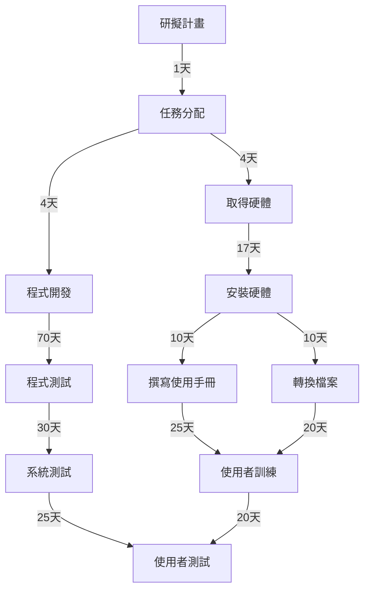
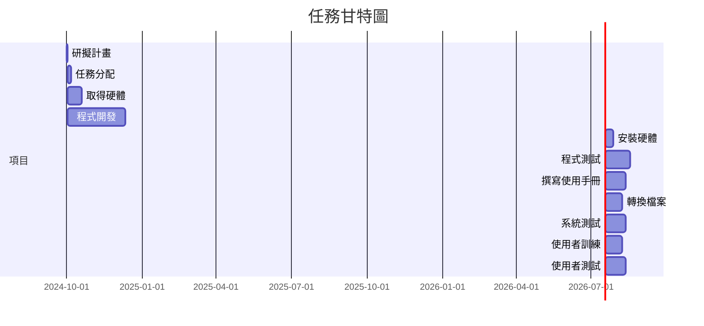

CPM/PERT 圖

```mermaid
graph TD
    A[研擬計畫] -->|1天| B[任務分配]
    B -->|4天| C[取得硬體]
    B -->|4天| D[程式開發]
    C -->|17天| E[安裝硬體]
    D -->|70天| F[程式測試]
    E -->|10天| G[撰寫使用手冊]
    E -->|10天| H[轉換檔案]
    F -->|30天| I[系統測試]
    G -->|25天| J[使用者訓練]
    H -->|20天| J
    I -->|25天| K[使用者測試]
    J -->|20天| K

```

甘特圖

```mermaid
gantt
    title 任務甘特圖
    dateFormat  YYYY-MM-DD
    section 項目
    研擬計畫          :a1, 2024-10-01, 1d
    任務分配          :after a1  , 4d
    取得硬體          :after a1  , 17d
    程式開發          :after a1  , 70d
    安裝硬體          :after a3  , 10d
    程式測試          :after a4  , 30d
    撰寫使用手冊      :after a5  , 25d
    轉換檔案          :after a5  , 20d
    系統測試          :after a6  , 25d
    使用者訓練        :after a7  , 20d
    使用者測試        :after a9  , 25d

```
